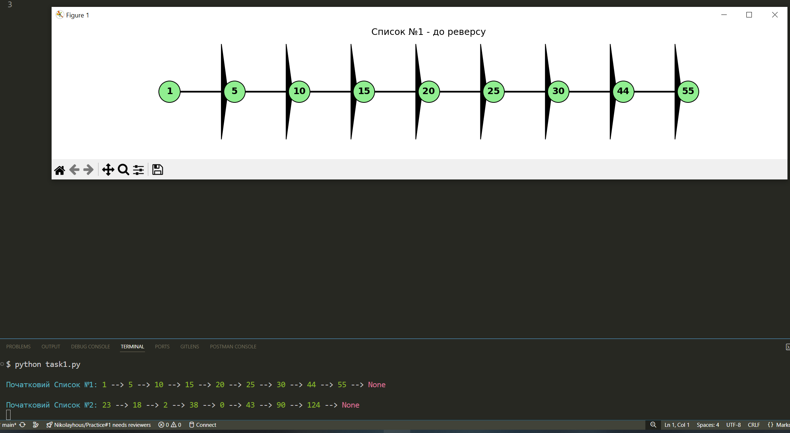
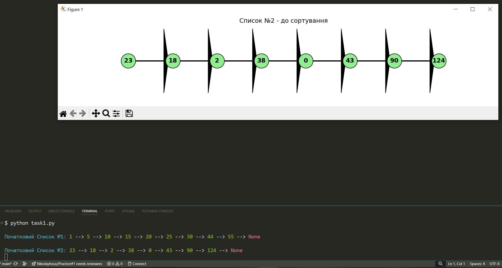
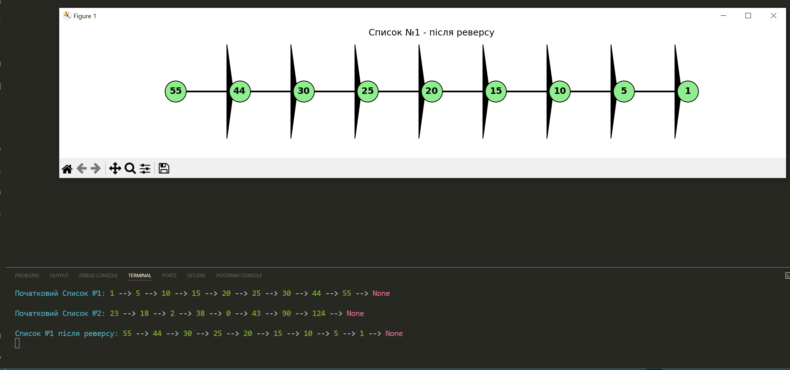
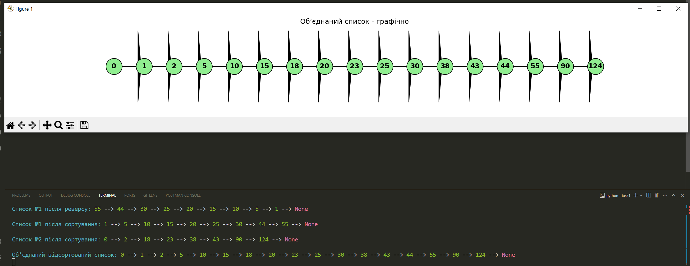

###### * зроблено самостійно у зв'зку з необхідністю поглиблення знань у сфері кібербезпеки, та щоб не задавати питання "Для чого то треба?" *

# Висновок: застосування структури зв’язного списку та візуалізації в кібербезпеці

### При виконанні першого завдання реалізовано: реверсування, сортування вставками та об'єднання відсортованих списків, створено візуалізацію цих процесів. 

### Під час виконання роботи повстало питання, а як саме можна пов'язати завдання з кібербезпекою? Де подібні структури та методи можуть стати у пригоді в сфері інформаційної безпеки ?

* знайдені застосування знайдені у інтернеті, та доповнені за допомогою ШІ

### 1. Аналіз журналів подій (логів)

#### Один із базових інструментів фахівця з кібербезпеки - це журнали подій, наприклад, логи входів у систему, журнали підозрілих мережевих з'єднань чи списки виконаних команд.

#### Утаких журналах:
 - кожен запис пов'язаний з попереднім (в часі)
 - записи часто формуються у хронологічному порядку, тобто природно утворюють однозв’язний список
 - для аналізу важливо мати можливість реверсувати список (наприклад, подивитись події від останньої до першої)

    > Приклад:
    >> спеціаліст з кібербезпеки використовує реверсування логів доступу до сервера, щоб швидко з'ясувати, які останні дії передували несанкціонованому входу.

#### reverse_list(), який був написаний, дає підхід для такого роду аналізу. А візуалізація дозволяє розпізнати шаблони - це, може допомагати у навчанні або, можливо, при розслідуваннях інцидентів.

### 2. Побудова черг запитів або атак (наприклад, DoS-атаки)

#### У деяких видах атак, наприклад, атаках типу DoS, на сервер надсилається велика кількість запитів, які формуються чергою. 

#### Вони можуть:
 - надходити в реальному часі
 - мати час або індекс
 - потребувати сортування за критичністю або обсягом

#### Як можливий варіант використання однозв’язного списку допомага зберігання запитів в оперативній структурі, а функції сортування дозволяють визначити масовані або підозрілі запити.

 - 
    > Приклад::
    >> надіслані запити сортуються за розміром пакету або швидкістю надходження, і візуально можна виявити, які саме запити перевищують норму.

####  merge_sorted_list(), можливо, можна об'єднати запити з різних джерел у загальну "картину".

### 3. Побудова схем зв’язків між підозрілими IP або обліковими записами

#### У випадках розслідувань інцидентів безпеки потрібні схеми взаємодії:

 - хто з ким контактував (IP до IP, користувач до сервісу)
 - у якому порядку взаємодії відбувались
 - які вузли були проміжними

 #### якщо розглядати це саме в такому розрізі, то це схоже на графи коли ми будуємо зв'язки, тобто вузел - це або подія, або людина яка використовує компьютер. Також можна представити цю ситуацію, як зв'язний список.

 - 
    > Приклад
    >> зафіксовано зв’язок: IP1 → IP2 → IP3. Це послідовність стрибків у VPN або ботнет-ланцюгу. Реверс і сортування допомагає перебудувати цей шлях за певними критеріями: час, країна, довжина стрибка.

#### Можливість візуалізувати такі послідовності, дає більш наочне розуміння зв'язків та конкретизує IP. Візуалізація надасть більше інформації, як варіант, наприклад керівництву.

### Якщо підсумувати надбані знання в цьому розділі завдання, то, у зв'язці з кібербезпекою, можна сказати, що АЛГОРИТМИ:

 - готують ґрунт для побудови аналітичних систем обробки подій безпеки
 - формують уявлення про структуроване представлення даних, яке потрібне в кіберзахисті
 - дають змогу створювати інструменти, що допомагають бачити закономірності в атаках і логах
 - тренують мислення в напрямку логічної побудови послідовностей, які є серцевиною аналізу інцидентів

#### Завдяки візуалізації, навіть складні логічні зв’язки вдається подати зрозумілою, навіть для початківців((або керівництва:)), формою - що особливо цінно при спільній роботі, презентаціях або поясненні результатів своєї роботи.

###### Принт скрін роботи коду завдання № 1

######

* Додаткові данні по typing.Optional знайдено по адресу:

https://docs.python.org/uk/3.13/library/typing.html#typing.Optional

"""
typing.Optional
Optional[X] еквівалентно X | None (або Union[X, None]).
якщо дозволено явне значення None, використання Optional є доречним,
незалежно від того, чи є аргумент необов’язковим.
Наприклад:

def foo(arg: Optional[int] = None) -> None:
    ...
"""

"""
* for python analyser
 if prev and cur:
    prev.next = cur.next

https://stackoverflow.com/questions/73005493/why-is-prev-curr-next-necessary-for-an-iterative-solution-of-reverse-link-list

https://leetcode.ca/2016-06-23-206-Reverse-Linked-List/#google_vignette

"""
######

