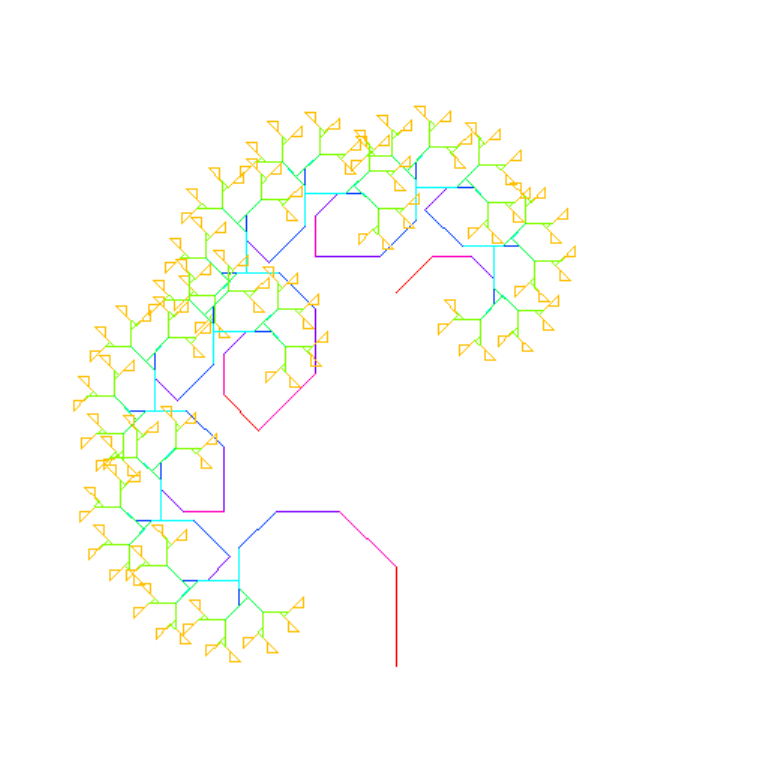

# Висновки: Дерево Піфагора і Кібербезпека: What's going on 👀 ?

#### Під час виконання другого завдання про "дерево Піфагора", за допомогою рекурсії та модуля turtle, виникало питання: "Де тут черепашка у кібербезпеці?" Ну так я вчуся логічно думати, бути уважним, використовувати ресурси типу " Turtle manual", це ж звичайна графічна вправа для розвитку логіки, уваги та  чудова модель для розвитку аналітичного мислення, і так це - критично важливе в кібербезпеці. Але як саме пов'язати задання №2 і кібер безпеку?

#### 👀 Почнемо

### 1. Рекурсія

#### У кібербезпеці існують вкладені події:
 - 
    > користувач запускає скрипт 
    >> скрипт викликає інший процес
    >>> той відкриває мережеве з’єднання
    >>>> і так далі.

#### Це ланцюг дій, який дуже схожий на гілки дерева. Тобто рекурсивне створення гілок дерев, схоже на ланцюг логів(це моє припущення). 

### 2. Візуалізація(для вивода структури атаки(як варіант))

#### У кібербезпеці працюють з візуалізацією дерев подій, графами взаємодійй між IP, ланцюгами атак(MITRE). Якщо навчитися бачити структуру, а не набір подій, то можливо буде простіше працювати з інструментами типу ELK Stack (Elasticsearch, Logstash, Kibana), Splunk або GaphViz(інструменти які використовуються в роботі)

### 3. Робота з побудовою дерева, для аналітичного мислення... чи ні?

#### Для того щоб побудувати дерево потрібно кнтроль глибини(перевантаження), помилки(якщо користувач закрив вікно, а програма ще працює), межі(в яких межах мають бути гілки)

#### Чи схоже це на роботу з логами? фільтрація даних, обробка винятків, обмеженняобсягу та увага тільки до того що важливо? 

### 4. Кольори, для візуальної аналітики...

####  Я постарався зробити так щоб кольори дерева відображали інакший рівень, ну така була ідея. Чи вийшло так, не впевнений але дерево різнобарвне 😂 . Можливо при глибшому вивчені можна, зробити так щоб кожний рівень відображався своїм кольором.

#### У кібербезпеці це використовується в heatmap в Kibana, графіках активності в Splunk, візуалізації ризиків (наприклад, червоний = критично, зелений = безпечно)...

### 5. Приклад: як це виглядає в реальних інструментах(взято з інтернету)
 - Splunk
    - Дозволяє будувати дерева подій, де кожна гілка — це новий процес або дія.
    - Має власну мову запитів (SPL), яка дозволяє фільтрувати, групувати, візуалізувати.
    - Використовується для аналізу атак, логів, поведінки користувачів.

 - ELK Stack
    - Відкритий аналог Splunk
    - Logstash збирає події, Elasticsearch зберігає, Kibana візуалізує
    - Можна побудувати граф подій, де видно, як розвивалась атака

 - GraphViz
    - Інструмент для побудови графів
    - Часто використовується для візуалізації взаємозв’язків: хто з ким з’єднувався, які процеси породили інші
    - Можна експортувати з логів у формат .dot і побудувати граф

### Тобто, виконуючи і вдосконалюючи завдання, тренуєш мислення, бачення вкладеності, контролюєш ресурси(хоча не завжди це підходить), візуалізація у майбутньому допоможе більш чітко пояснювати та бачити аномалїї, трафіку, як приклад.

* Посилання
- [Splunk vs ELK Stack: порівняння можливостей](https://betterstack.com/community/comparisons/splunk-vs-elastic-stack-elk/)
- [GraphViz — офіційний сайт](https://graphviz.org/)
- [ELK Stack: що це і як працює](https://diggers-consulting.com/data-engineering/splunk-vs-elastic-stack-elk-how-to-choose)

###### Принтскрін роботи рекурсії 8

