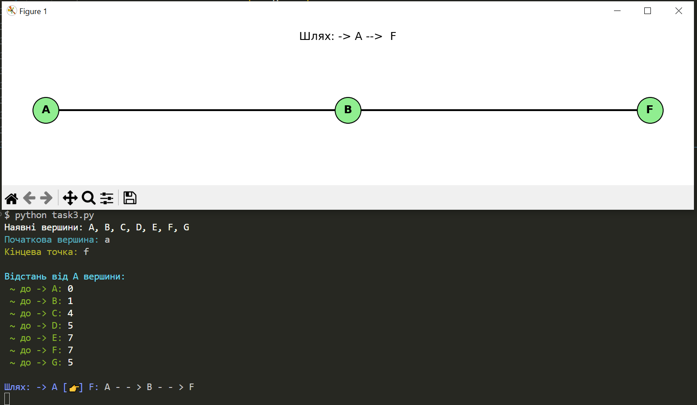
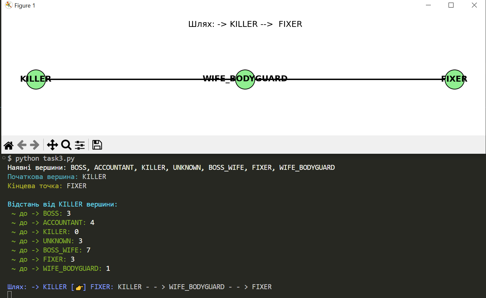

# Чи пов'язаний алгоритм Дейкстри із кібербезпекою 👀 ?

### 1. Аналіз маршрутів атак

#### У сфері кібербезпеки використовують графи атак (attack graphs). Це моделі, які показують, як зловмисник може пройти через систему - від початкової точки доступу до цілі (наприклад, бази даних або адміністративного сервера). Кожна вершина - це стан системи, а ребра - можливі дії зловмисника. Алгоритм Дейкстри дозволяє знайти найкоротший або найменш затратний шлях атаки.

#### Якщо брати ці умови до уваги, то це допомагає виявити найвразливіші місця в системі, оцінити, наскільки легко зловмисник може досягти цілі, пріоритезувати захист саме тих вузлів, які входять у найкоротші шляхи.


### 2. Маршрути у мережах

#### У комп'ютерних мережах (локальних або глобальних) маршрутизатори використовують алгоритми, щоб знайти найкращий шлях для передачі даних. Наприклад, протокол OSPF (Open Shortest Path First) - один із найпоширеніших у корпоративних мережах.


##### OSPF(англ. Open Shortest Path First) — протокол динамічної маршрутизації, заснований на технології відстеження стану каналу (link-state technology), що використовує для знаходження найкоротшого шляху Алгоритм Дейкстри (Dijkstra's algorithm).

[OSPF](https://uk.wikipedia.org/wiki/OSPF)

[GeekForGeeks-Dijkstra](https://www.geeksforgeeks.org/applications-of-dijkstras-shortest-path-algorithm/)


### 3. Візуалізація зв'язків між фігурантами певної справи

#### Я змоделював окремий граф, та закоментував у цьому файлі... Таке моделювання — лише базовий приклад, але хоча б, дає розуміння як воно може допомогти у майбутньому і як використовувати. У графі кожна вершина - це фігурант справи (наприклад, Boss, Accountant, Killer тощо). Такий підхід дуже схожий на OSINT-аналіз (Open Source Intelligence), який використовують у кіберрозвідці. Аналітики будують графи зв'язків між людьми, компаніями, IP-адресами, доменами для пошуку зв'язків.

#### Тобто, Дейкстра може допомогти(звісно його треба удосконалити для певної ситуації) виявити зв'язки, знайти посередників ну і просто візуалізувати всю структуру(якщо вдосконалити код під потреби) 


[AnalyticsSteps-Dijkstra](https://www.analyticssteps.com/blogs/how-dijkstras-algorithm-used-real-world)


### Виходячі з того, що існує багато статей написаних спеціалістами у сфері кібербезпеки, можна зробити висновок що, Алгоритм Дейкстри НЕ ПРОСТО теорія. Алгоритм Дейкстри - це інструмент, який використовується в реальних системах кібербезпеки: від аналізу мереж до виявлення маршрутів атак.


##### Принт скрін роботи коду

✅




🤔


```python
<!--  ✔️ якщо вершинам дати назви -->
 graph = {
    "BOSS": [("ACCOUNTANT", 1), ("KILLER", 4), ("UNKNOWN", 5), ("BOSS_WIFE", 7)],
    "ACCOUNTANT": [("BOSS", 1), ("KILLER", 3), ("UNKNOWN", 8), ("FIXER", 6)],
    "KILLER": [("BOSS", 3), ("ACCOUNTANT", 7), ("UNKNOWN", 3), ("WIFE_BODYGUARD", 1)],
    "UNKNOWN": [("BOSS", 5), ("ACCOUNTANT", 2), ("KILLER", 1), ("FIXER", 4)],
    "BOSS_WIFE": [("BOSS", 7), ("FIXER", 4), ("WIFE_BODYGUARD", 6), ("KILLER", 5)],
    "FIXER": [("ACCOUNTANT", 6), ("UNKNOWN", 4), ("BOSS_WIFE", 4), ("WIFE_BODYGUARD", 2)],
    "WIFE_BODYGUARD": [("KILLER", 1), ("FIXER", 2), ("BOSS_WIFE", 6), ("BOSS", 9)]
}
```


