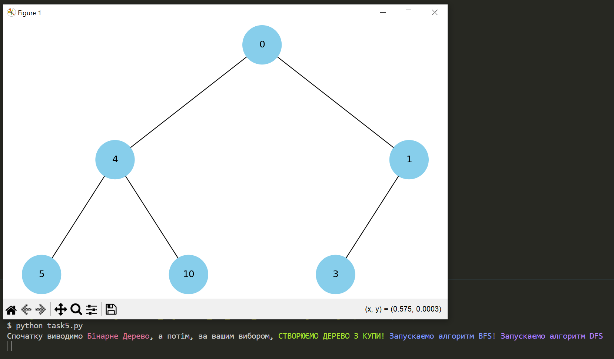
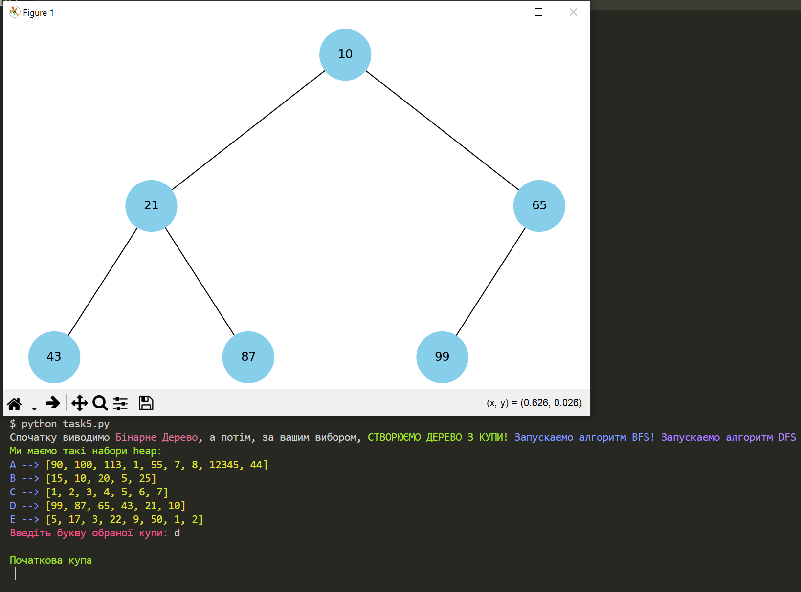
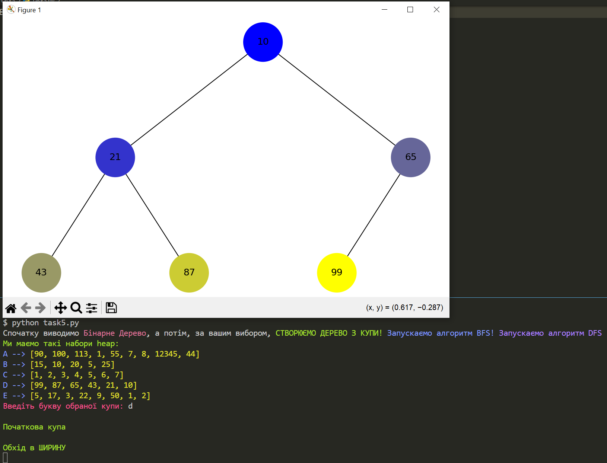
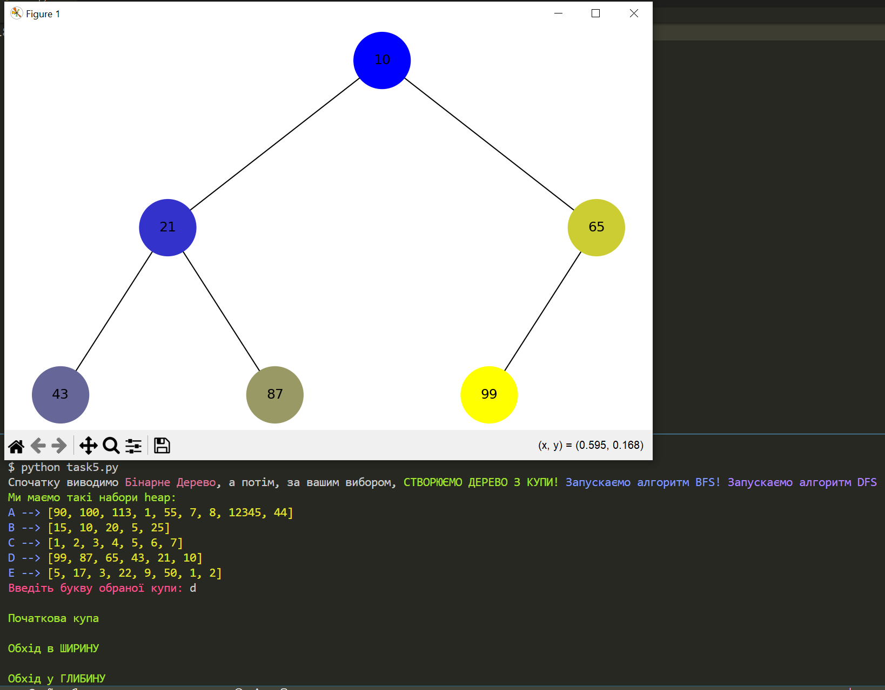
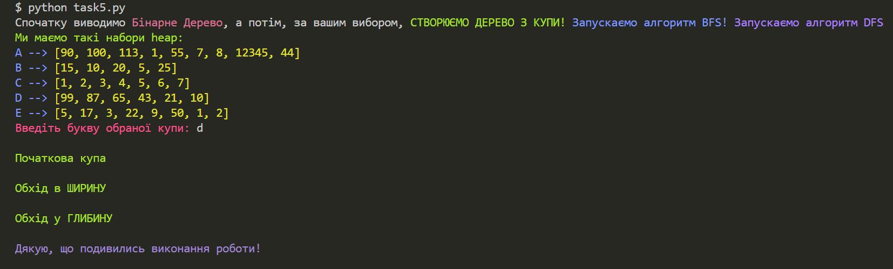

# Коментарі до роботи № 5

## Додано:

#### 1. bfs_algorithm()
#### 2. dfs_algorithm()
#### 3. make_colors()
#### 4. Додано до виводу
 ```python
 print(f"Спочатку виводимо {Fore.RED}Бінарне Дерево{Style.RESET_ALL}, \
а потім, за вашим вибором, {Fore.LIGHTGREEN_EX}СТВОРЮЄМО ДЕРЕВО З КУПИ! {Fore.LIGHTBLUE_EX}Запускаємо алгоритм BFS! {Fore.LIGHTMAGENTA_EX}Запускаємо алгоритм DFS! {Style.RESET_ALL} ")
```
#### 5. bfs_order
#### 6. dfs_order


##### Прінт скрін роботи програми

* Перший крок




* Другий крок




* Третій крок




* Четвертий крок




* Завершення програми

