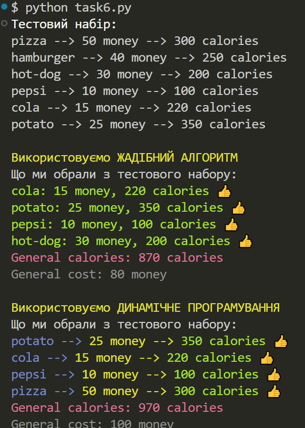

# Висновок: Як пов'язані жадібні алгоритми та динамічне програмування з кібербезпекою

### 1. Жадібний алгоритм

#### Якщо взяти до уваги той факт, що жадібний алгоритм вирізняється своєю швидкістю і простотою, але НЕ завжди гарантує досягнення глобального оптимуму. Орієнтуючись на швидкість роботи з локальними даними. То його можна використовувати у фільтрації шкідливого трафіку(обирати найбільш підозрілі пакети(як варіант)), оптимізувати ресурси(якщо бюджет обмежений. які засоби нам доступні) або виборі точок доступу для аналізу(або моніторингу) загроз.

#### Отже, що ми можемо виділити:
 - швидкість(прийняття рішення в реальному часі)
 - ефективніть при прийнятті рішення з обмеженим ресурсом

### 2. Динамічне програмування

#### Динамічне програмування — це метод розв'язання складних задач шляхом розбиття їх на простіші підзадачі.

#### Отже, цей спосіб використовується при оптимізації рішень та аналізі залежностей. Він враховує всі можливі комбінції при глибокому аналізі. Знаходить оптимальне рішення серед усіх можливих, має високу адаптивність до загроз та атак.

#### Варіанти застосування
 - виявлення аномалій у мережі(аналіз вже набутих данних для прогнозування дій кібеззлочинців у майбутньому)
 - оптимізація навантаження(захист при змінних умовах)
 - аналіз паттернів для виявлення загроз, тобто просто розпізнавання коду

### Висновок

#### ✔️ __Жадібний алгоритм - це швидке прийняття рішень у реальному часі.__

#### ✔️ __Динамічне програмування - це глибокий аналіз та оптимізація захисту.__

#### Отже використовуючи жадібні алгоритми та динамічне програмування, можна створювати ефективні системи які зможуть реагувати на загрози та оптимізувати розподіллення ресурсів

* Прінт скрін результату роботи програми

