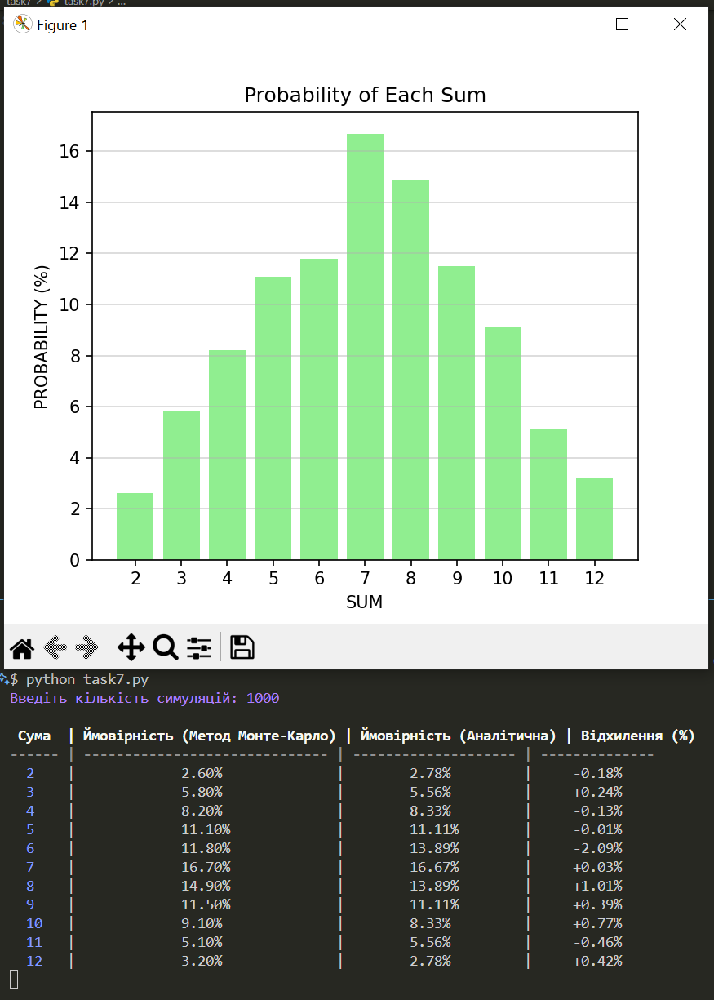
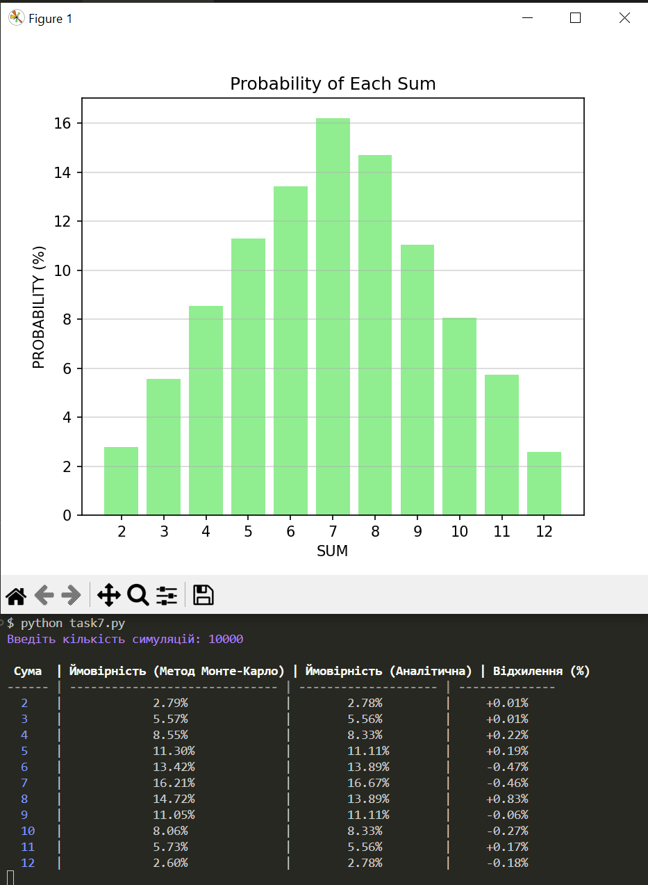
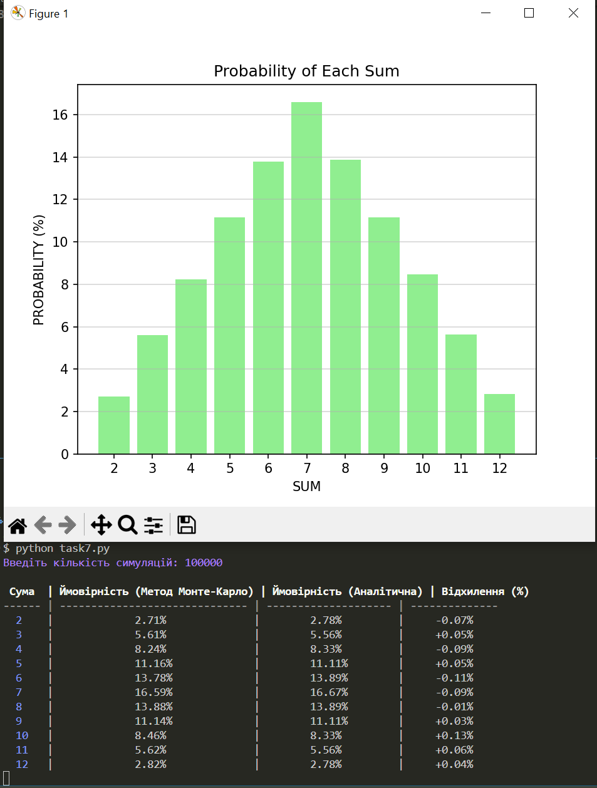

# Висновки

## Порівняння ймовірностей кидання двох кубіків

### Зроблено симуляцію кидків різної кількості. Дані симуляції представлені у скрінах. Та розраховано процент відхилення. Порівнювалися методи Монте-Карло та аналітичні розрахунки.

## Аналіз результатів

### 1. Точність

#### Метод Монте-Карло показує високу точність, особливо при збільшенні кількості симуляцій.

 - При 1000 симуляціях відхилення досягає ±2.09%
 - При 10000 симуляціях відхилення зменшується до ±0.83%
 -  При 100000 симуляціях максимальне відхилення не перевищує ±0.11%
 -  При 1 000 000 симуляціях відхилення менше ±0.05%, що майже ідеально відповідає аналітичним розрахункам

#### Чим більше симуляцій, тим точніші результати свідчить про залежність методу Монте-Карло від великої кількості симуляцій.

### 2. Відповідність аналітичним розрахункам

#### Метод Монте-Карло наближається до теоретичних значень, але має невеликі статистичні відхилення.

 - При малих симуляціях (1000) деякі значення значно відрізняються (-2.09% для 6)
 - При 1000000 симуляціях всі значення майже ідентичні аналітичним (±0.01%)

#### Метод Монте-Карло підтверджує аналітичні розрахунки. При великій кількості симуляцій похибка мінімальна, що можна побачити на скрінах.

### 3. Природа відхилень

#### Відхилення виникають через статистичну випадковість та обмежену кількість симуляцій.

- При 1000 симуляціях деякі значення сильно відрізняються (-2.09% для 6)
- При 1000000 симуляціях всі значення дуже близькі до аналітичних (±0.01%)

#### Причини відхилень випадковість у генерації чисел (np.random.randint(1, 7)). Чим більше симуляцій, тим менше вплив випадковості. Але випадковості є нормальною частиною використання методу Монте-Карло.

### __Висновок по методу Монте-Карло__

#### Метод Монте-Карло ефективний для моделювання ймовірностей, але його точність залежить від кількості симуляцій.

#### Отримані результати за допомогою методу Монте-Карло дуже близькі до аналітичних значень, що підтверджує ефективність і точність симуляцій при достатньо великій кількості ітерацій. Це демонструє, що метод Монте-Карло може бути надійним інструментом для оцінки ймовірностей у випадкових процесах, таких як кидання кубиків.

#### Метод Монте-Карло підтверджує аналітичні розрахунки. Чим більше симуляцій, тим точніші результати. Для високої точності бажана велика кількість симуляцій або більше. ми зробили максимум 1_000_000 🤓.

##### ___П.С. Метод Монте-Карло активно використовується в кібербезпеці для аналізу ризиків та ймовірностей атак. Наприклад оцінка ризиків DDOS, криптографія(стійкість алгоритмів шифрування), аналіз злому пароля(моделюваннявипадкових спроб), аналіз поведінки користувачів(так сказати виявлення аномалій) ___

#### ___Як висновок по Монте-Карло і його використанню в кібербезпеці можна виділити такі пункти: ___

 - ___допомагає прогнозувати ймовірність атак ___

 - ___оцінки ризиків ___

 - ___аналіз великих обсягів даних для виявлення загроз ___

#### Можна виділити такі пункти по методу Монте-Карло:

 - Метод Монте-Карло підтверджує аналітичні розрахунки 🤓

 - Чим більше симуляцій, тим точніші результати ✳️

 - Відхилення виникають через статистичну випадковість 👈

 - Метод активно використовується в кібербезпеці для аналізу ризиків 😑

##### Прінт скрін результату роботи коду

* 1_000

 

 * 10_000

 

 * 100_000

 

 * 1_000_000

 